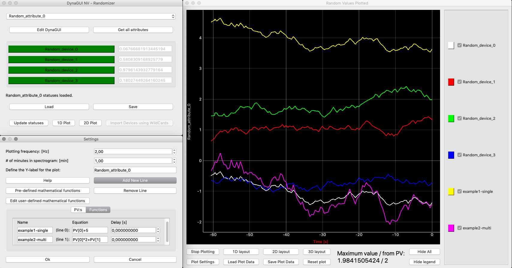

# Summary

At large research facilities and industrial complexes, there is a need of control system user interfaces. However, modern facilities also require continuous upgrading, maintenance, and development, which means that also the control systems need to be upgraded. In order to simplify the construction of control systems and diagnostics, I created the DynaGUI (Dynamic Graphical User Interface) package. The main idea of this package is to get rid of the middle-hand coding needed between hardware and the user by supplying the user with a simple GUI toolkit for generating diagnostics- and control-system GUI:s in accordance with any user’s need.

In order to further enhance the user-friendliness of this package, a simple system for configuration files has been developed enabling users to configure it using any plain text-editor. The DynaGUI package consists of three applications:
- DynaGUI TF, a true/false (boolean) dynamic control system,
- DynAlarmsGUI, a dynamic diagnostics system for continuously monitoring of the values for a set of attributes, and
- DynaGUI NV, a system for observing attributes' numerical-, string-, vector- or waveform values.

Each DynaGUI application's layout is designed for having as high level of simplicity as possible. At the top of each application is a combobox with the list of attributes defined. Below the combobox is a button called 'Edit DynaGUI', which opens a window for configuring the DynaGUI. Below the 'Edit DynaGUI'-button is the dynamic field, in which a dynamic control panel is generated. Below the dynamic control panel field is the DynaGUI status bar, showing the last action carried out, error messages, or if an alarm is active (fro DynAlarmsGUI). Below the status bar is the load and save buttons for loading or saving DynaGUI configuration files, which also have a tool-tip function showing the last loaded or saved file (in the current session). The simplest method to launch DynaGUI is via its launcher (Launcher.py), in which the user can select control system and either directly define the path to the configuration file or browse to it. Leaving it blank results in that DynaGUI will load with a predefined setup.

The package aims to enable users to construct dynamic GUI:s for multiple purposes, and the author is open for implementing new functions and control systems on demand. For testing purposes, an artificial control system 'Randomizer' has been created displaying only random values.

# Figures

# Acknowledgements
The author recognizes and wants to thank Jonas Petersson and Robin Svard, Accelerator Operators at the MAX IV Laboratory, for developing the original 2D Spectrogram Application for monitoring transverse beam position via Beam Position Monitors at the MAX IV Laboratory storage rings. The author used their codes as inspiration for developing a generic algorithm which can initialize a 2D spectrogram for any given list of devices with attributes. The author also wants to thank Bernhard Meirose, also an Accelerator Operator at the MAX IV Laboratory, for giving the inspiration and awakening the idea to creating this package.

# References